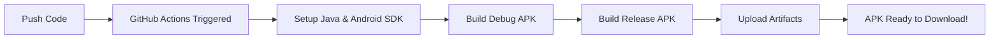

# 🚀 GitHub Actions Setup for Automatic APK Builds

This guide will set up automatic APK building every time you push code to GitHub.

## Step 1: Create GitHub Repository

```bash
# Initialize git in your project
cd /Users/stephenmunabo/Documents/projects/songtrybe-tv
git init

# Add all files
git add .

# Create initial commit
git commit -m "Initial commit: Songtrybe TV Android app"

# Create repository on GitHub (via GitHub CLI)
gh repo create songtrybe-tv --public --source=. --remote=origin --push

# OR manually:
# 1. Go to https://github.com/new
# 2. Create repository named "songtrybe-tv"
# 3. Run:
git remote add origin https://github.com/YOUR_USERNAME/songtrybe-tv.git
git branch -M main
git push -u origin main
```

## Step 2: Add Secret for google-services.json

1. Go to your GitHub repository
2. Click **Settings** → **Secrets and variables** → **Actions**
3. Click **New repository secret**
4. Name: `GOOGLE_SERVICES_JSON`
5. Value: Copy the entire contents of your `google-services.json` file:

```bash
# Get the base64 encoded content (run this locally)
base64 -i songtrybe-tv-app/app/google-services.json | pbcopy  # macOS
# OR
base64 songtrybe-tv-app/app/google-services.json | xclip -selection clipboard  # Linux
```

6. Paste the base64 string and save

## Step 3: GitHub Actions Workflow is Already Created!

The workflow file `.github/workflows/build-tv-app.yml` is already in your project. It will:

✅ Build automatically on every push to `main` or `develop` branch
✅ Build both Debug and Release APKs
✅ Upload APKs as downloadable artifacts
✅ Create releases when you tag versions

## Step 4: Push Your Code

```bash
# Make sure workflow file is added
git add .github/workflows/build-tv-app.yml

# Commit and push
git commit -m "Add GitHub Actions workflow for automatic builds"
git push origin main
```

## Step 5: Watch It Build! 

1. Go to your GitHub repository
2. Click the **Actions** tab
3. You'll see "Build Songtrybe TV App" workflow running
4. Wait ~3-5 minutes for build to complete

## Step 6: Download Your APK

1. In the Actions tab, click on the completed workflow run
2. Scroll down to **Artifacts**
3. Download `app-debug` (ready to install APK)


## 📱 Direct Download Links

After each build, your APKs will be available at:
- Debug APK: `https://github.com/YOUR_USERNAME/songtrybe-tv/actions/runs/WORKFLOW_ID`

## 🏷️ Creating Releases (Optional)

To create a release with downloadable APKs:

```bash
# Tag a version
git tag -a v1.0.0 -m "Release version 1.0.0"
git push origin v1.0.0
```

This will automatically create a GitHub Release with APK downloads!

## 🔄 Automatic Builds Triggers

The app will build automatically when:
- ✅ You push to `main` branch
- ✅ You push to `develop` branch  
- ✅ Someone opens a pull request
- ✅ You manually trigger from Actions tab
- ✅ You create a version tag (also creates release)

## 📊 Build Status Badge

Add this to your README.md to show build status:

```markdown

```

## 🎯 Quick Commands

```bash
# Push code (triggers build)
git add .
git commit -m "Your changes"
git push

# Create a release
git tag v1.0.1
git push --tags

# Check build status
gh run list
gh run view
```

## 🔧 Customizing the Workflow

Edit `.github/workflows/build-tv-app.yml` to:
- Change trigger branches
- Add more build variants
- Include unit tests
- Deploy to Play Store (requires more setup)

## 💡 Pro Tips

1. **Faster Builds**: The workflow caches Gradle dependencies
2. **Debug Info**: Click any step in the workflow to see detailed logs
3. **Multiple Variants**: Both debug and release APKs are built
4. **PR Testing**: Open a PR to test changes before merging

## 🆘 Troubleshooting

### Build Fails with "google-services.json not found"
- Make sure you added the `GOOGLE_SERVICES_JSON` secret correctly
- The secret should be base64 encoded

### "Permission denied" error
- Make sure the gradlew file has execute permissions:
```bash
git update-index --chmod=+x songtrybe-tv-app/gradlew
git commit -m "Make gradlew executable"
git push
```

### Artifacts not appearing
- Check the Actions tab for error messages
- Ensure the build completed successfully

## 📈 What Happens on Each Push



## 🎉 Success!

Once set up, you'll never need to build locally again! Just:
1. Push your code
2. Wait 3-5 minutes
3. Download APK from Actions tab

No Android Studio, no local builds, just code and deploy! 🚀